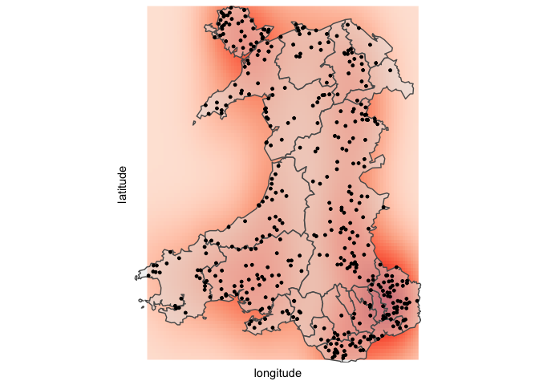
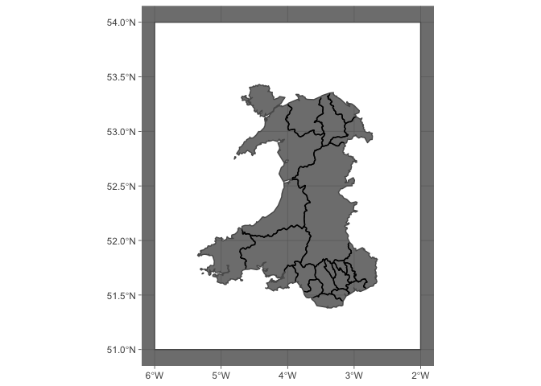

Llan Distribution in Wales
================

## Load Data

`uk-towns.csv` is a file containing coordinates and meta data for all
cities, towns and villages in the UK. Here I am only interested in
Wales, therefore I have filtered the data to only include places within
the country of Wales.

``` r
UKTowns <- read.csv('uk-towns.csv')
UKTowns %>%
  filter(country=='Wales') -> WalesTowns
```

## Preparing Data for plotting

``` r
WalesTowns %>%
  mutate(IsLlan = if_else(grepl('Llan',name), 'Llan', 'Not a Llan')) -> WalesTownsTidy

WalesTownsTidy %>%
  filter(IsLlan == 'Llan') -> Llans

WalesTownsTidy %>%
  filter(IsLlan == 'Not a Llan') -> NotLlans
```

## Map

``` r
shapefile <- readOGR(dsn="Local Authority Districts UK Shape Files",
layer = 'Local_Authority_Districts__May_2020__UK_BUC')
```

    ## Warning in OGRSpatialRef(dsn, layer, morphFromESRI = morphFromESRI, dumpSRS =
    ## dumpSRS, : Discarded datum OSGB_1936 in Proj4 definition: +proj=tmerc +lat_0=49
    ## +lon_0=-2 +k=0.9996012717 +x_0=400000 +y_0=-100000 +ellps=airy +units=m +no_defs

    ## OGR data source with driver: ESRI Shapefile 
    ## Source: "/Users/louiscaruana/Documents/GitHub/Maps/Llan Distribution in Wales/Local Authority Districts UK Shape Files", layer: "Local_Authority_Districts__May_2020__UK_BUC"
    ## with 379 features
    ## It has 10 fields

``` r
mapdata <- tidy(shapefile, region="LAD20NM")
```

    ## Warning in RGEOSUnaryPredFunc(spgeom, byid, "rgeos_isvalid"): Ring Self-
    ## intersection at or near point 486959.84970000002 134505.30050000001

    ## SpP is invalid

    ## Warning in rgeos::gUnaryUnion(spgeom = SpP, id = IDs): Invalid objects found;
    ## consider using set_RGEOS_CheckValidity(2L)

``` r
shapefile <-st_as_sf(shapefile)
WalesShapeFile <- shapefile %>% filter(OBJECTID>357) 
```

``` r
ggplot() +
  stat_density2d(data = Llans, aes(x=longitude, y=latitude, fill=..density..),
                 geom = "raster", contour = FALSE) +
  scale_x_continuous(expand = c(0, 0)) +
  scale_y_continuous(expand = c(0, 0)) +
  scale_fill_gradientn(colours=(brewer.pal(4, "Reds"))) +
  theme(legend.position='none') +
  
  geom_sf(data=WalesShapeFile, 
          alpha = 0.5) +
  coord_sf(crs = st_crs(4326)) +
  theme(axis.line=element_blank(),
        axis.text.x=element_blank(),
        axis.text.y=element_blank(),
        axis.ticks=element_blank(),
    panel.grid.major = element_blank(),
    panel.grid.minor = element_blank(),
    panel.border = element_blank(),
    panel.background = element_rect(fill = "#FFFFFF")) +
  
  geom_point(data = Llans, aes(x=longitude, y=latitude),
             size = 1)
```

<!-- -->

``` r
mat <- list(matrix(c(-6, 51,
                     -2, 51,
                     -2, 54,
                     -6, 54,
                     -6, 51), 
              ncol = 2, 
              byrow = TRUE))
box <- st_polygon(mat)
box <- st_geometry(box)
box <- st_set_crs(box, 4326)
```

``` r
WalesShapeFile <- st_transform(WalesShapeFile, 4326)
WalesPoly <- st_boundary(WalesShapeFile)
WalesPoly <- st_combine(WalesPoly)
WalesPoly <- st_polygonize(WalesPoly)
boxPoly <- st_boundary(box)


WalesBoundryShapeFile <- st_sym_difference(box, WalesPoly)


ggplot( )+
  geom_sf(data=WalesBoundryShapeFile, 
          alpha = 1, fill = '#FFFFFF') +
  coord_sf(crs = st_crs(4326)) +
  theme_dark()
```

<!-- -->
